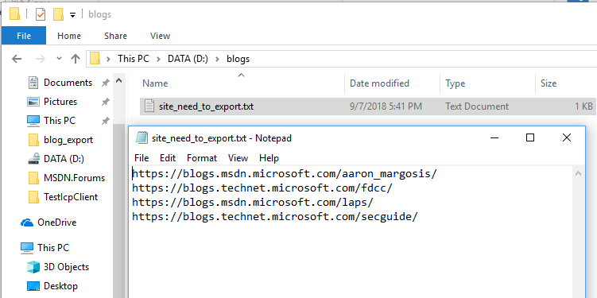
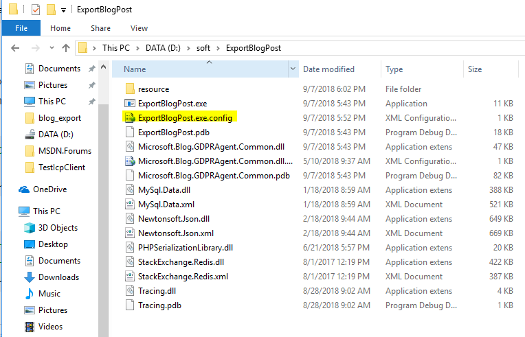
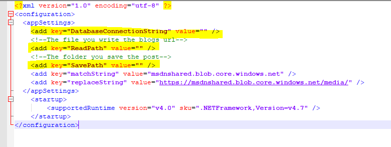
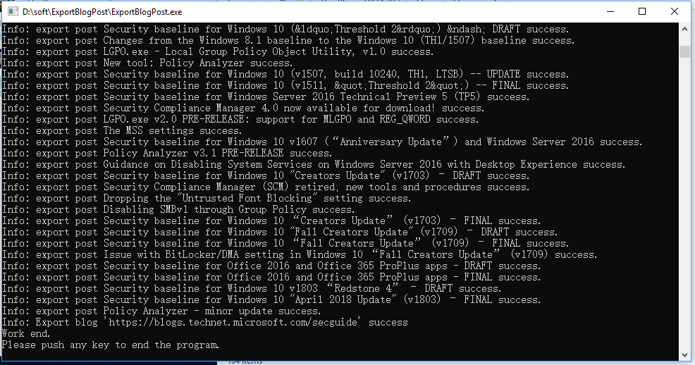
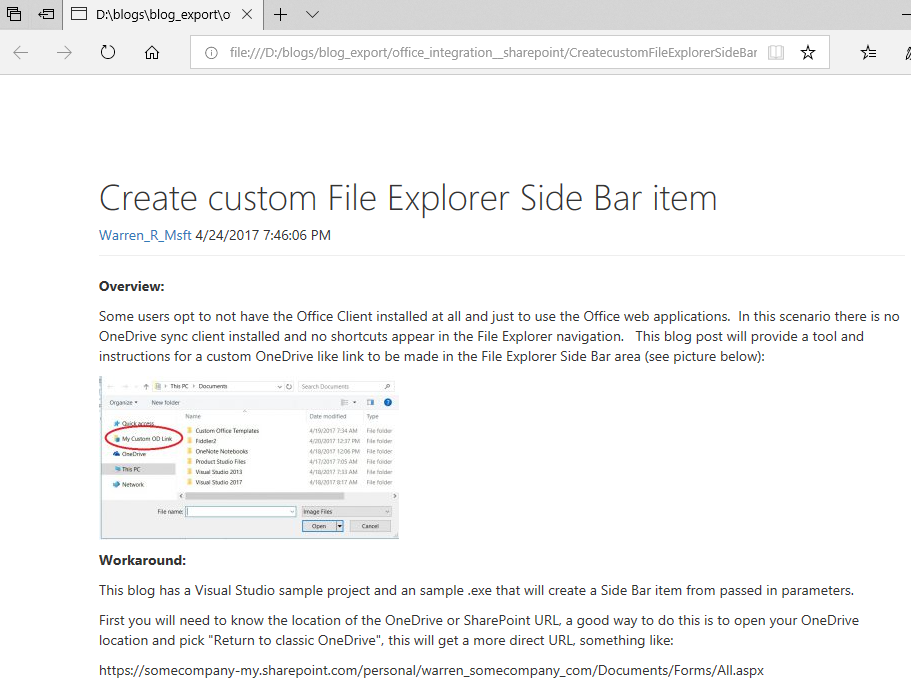

Steps for export blog posts to local file

1.  Create a file, input the blogs' url which need to export to it;

{width="6.5in" height="3.245833333333333in"}

Here I create a file"site\_need\_to\_export.txt", input 4 blogs' url to
it.

2.  Create a folder to save blogs' posts, or select a exist folder

{width="6.5in" height="2.6902777777777778in"}

Here I create a folder named "blog\_export"

3.  Open file **ExportBlogPost.exe.config**

{width="6.03125in" height="3.875850831146107in"}

4.  modify appSetting: DatabaseConnectionString, ReadPath, SavePath

{width="6.135416666666667in"
height="2.3106135170603674in"}

ReadPath is the full path of the **file** we create in **step 1**,

SavePath is the full path of the **folder** we create in **step 2**

Result is like below picture:

{width="6.5in" height="2.2743055555555554in"}

5.  Double click file ExportBlogPost.exe, wait program running complete,
    then you could see the result:

{width="8.166666666666666in"
height="4.240384951881015in"}

Each folder corresponds to a blog .

Each Html and markdown file corresponds to a post, all the attachments
of this blog is in folder "**media**"

6.  Push any key to end the program

{width="7.989583333333333in"
height="4.19709208223972in"}

We could see the html file directly, and the markdown files need upload
them to github, then could see them:

{width="8.254620516185478in"
height="6.197916666666667in"}

{width="9.0in" height="5.954861111111111in"}
