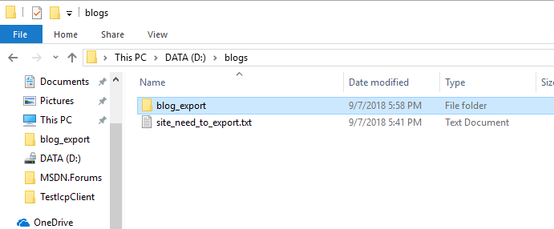

Steps for export blog posts to local file

1.  Create a file, input the blogs’ url which need to export to it;

Here I create a file”site\_need\_to\_export.txt”, input 4 blogs’ url to
it.

2.  Create a folder to save blogs’ posts, or select a exist folder

Here I create a folder named ”blog\_export”

3.  Open file **ExportBlogPost.exe.config**

4.  modify appSetting: DatabaseConnectionString, ReadPath, SavePath

ReadPath is the full path of the **file** we create in **step 1**,

SavePath is the full path of the **folder** we create in **step 2**

Result is like below picture:

5.  Double click file ExportBlogPost.exe, wait program running complete,
    then you could see the result:

Each folder corresponds to a blog .

Each Html and markdown file corresponds to a post, all the attachments
of this blog is in folder ”**media**”

6.  Push any key to end the program

We could see the html file directly, and the markdown files need upload
them to github, then could see them:

