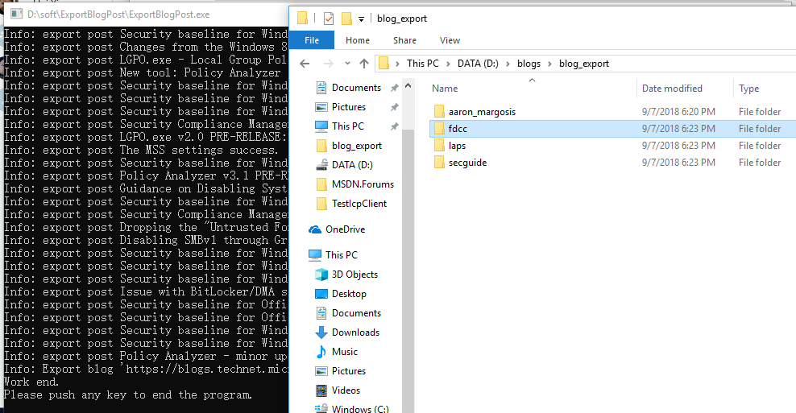

Steps for export blog posts to local file

1.  Create a file, input the blogs’ url which need to export to it;

Here I create a file”site\_need\_to\_export.txt”, input 4 blogs’ url to
it.

2.  Create a folder to save blogs’ posts, or select a exist folder

Here I create a folder named ”blog\_export”

3.  Open file **ExportBlogPost.exe.config**

4.  modify appSetting: DatabaseConnectionString, ReadPath, SavePath

ReadPath is the full path of the **file** we create in **step 1**,

SavePath is the full path of the **folder** we create in **step 2**

Result is like below picture:

5.  Double click file ExportBlogPost.exe, wait program running complete,
    then you could see the result:

Each folder corresponds to a blog .

Each Html and markdown file corresponds to a post, all the attachments
of this blog is in folder ”**media**”

6.  Push any key to end the program

We could see the html file directly, and the markdown files need upload
them to github, then could see
them:

| PartitionKey | RowKey                           | Timestamp                | blogId | blogId@type | blogSiteUrl                                                | blogSiteUrl@type | isDeactivated | isDeactivated@type |
| ------------ | -------------------------------- | ------------------------ | ------ | ----------- | ---------------------------------------------------------- | ---------------- | ------------- | ------------------ |
| 201806       | 0000a66020bc44b89cdc9f72f8ab8635 | 2018-06-02T00:05:00.857Z | 17373  | Edm.String  | https://blogs.msdn.microsoft.com/shauntj/                  | Edm.String       | y             | Edm.String         |
| 201806       | 000216bf98be467b9fbbbb1043a34412 | 2018-06-02T00:04:55.177Z | 126735 | Edm.String  | https://blogs.technet.microsoft.com/pfedude/               | Edm.String       | n             | Edm.String         |
| 201806       | 00026621111d42dab5c7e78db9527e9b | 2018-06-02T00:05:27.367Z | 73053  | Edm.String  | https://blogs.msdn.microsoft.com/wojtek/                   | Edm.String       | y             | Edm.String         |
| 201806       | 0002f596e8c94080838606ea610df584 | 2018-06-02T00:05:25.930Z | 69873  | Edm.String  | https://blogs.msdn.microsoft.com/narendra\_parihars\_blog/ | Edm.String       | n             | Edm.String         |
| 201806       | 00036b35dee449eb8e48e7ac8b932ecc | 2018-06-02T00:04:58.693Z | 14284  | Edm.String  | https://blogs.msdn.microsoft.com/dynamicsaxep/             | Edm.String       | y             | Edm.String         |
| 201806       | 00045364717547f78451db47cda9b1b9 | 2018-06-02T00:05:12.622Z | 40643  | Edm.String  | https://blogs.msdn.microsoft.com/ottoks/                   | Edm.String       | y             | Edm.String         |
| 201806       | 0005062fab5340008d27475048ea3eee | 2018-06-02T00:05:34.940Z | 90223  | Edm.String  | https://blogs.msdn.microsoft.com/soniapi/                  | Edm.String       | y             | Edm.String         |
| 201806       | 0008858372a442a4b10c3a7acd8a8d6a | 2018-06-02T00:05:00.483Z | 16563  | Edm.String  | https://blogs.technet.microsoft.com/mediaroom/             | Edm.String       | y             | Edm.String         |
| 201806       | 000bd1b4eaa040aea9af5bc595cddff1 | 2018-06-02T00:05:26.637Z | 72073  | Edm.String  | https://blogs.msdn.microsoft.com/dominic/                  | Edm.String       | y             | Edm.String         |
| 201806       | 000e82501a2e4121822499042b164f89 | 2018-06-02T00:05:12.279Z | 39643  | Edm.String  | https://blogs.technet.microsoft.com/uspartner\_learning/   | Edm.String       | n             | Edm.String         |
| 201806       | 000fb2c7b9274763bd78b7e41dbcc848 | 2018-06-02T00:05:05.929Z | 25493  | Edm.String  | https://blogs.technet.microsoft.com/surama/                | Edm.String       | n             | Edm.String         |
