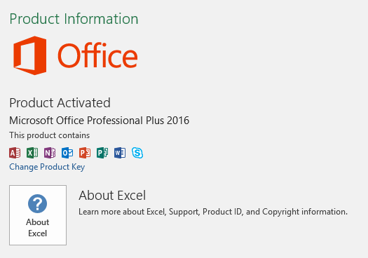

# Determining your Office version - MSI vs. C2R

[Zakir H -
MSFT](https://social.msdn.microsoft.com/profile/Zakir%20H%20-%20MSFT)
6/23/2016 10:29:31 PM

-----

When investigating an issue with your Microsoft Office applications, you
may need to determine whether you have the Windows Installer (MSI) based
version of Office or the Click-to-Run (C2R) version of Office. These
versions are based on different installation methods.

The MSI based version of Office uses Windows Installer technology, which
is a traditional method of installing and updating Office. If you
install Office by using MSI, you have to wait until the whole Office
product is installed before you can open and start to use the product.
The C2R based version of Office uses Click-to-Run, which is a Microsoft
streaming and virtualization technology that allows you to open and
start to use the product before the whole product is installed.
Click-to-Run is the technology used to install Office 365 subscription
products, while the MSI is used mainly to install the volume license
editions of Office.

 

To find out whether your installation is MSI or C2R, in the Microsoft
Office application, such as Word or Excel, go to **File \> Account**. If
you see an **Office Updates** section, the installation is C2R:

 

 

If there is no **Office Updates** section, then it is an MSI
installation:

 

 

