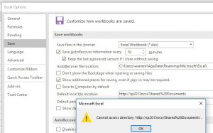

# Excel 2016 Default save location gives error

[Warren\_R\_Msft](https://social.msdn.microsoft.com/profile/Warren_R_Msft)
2/22/2017 4:49:59 PM

-----

**Overview:**

You have Excel 2016 and try to change the default save location to a
SharePoint location and get error:

"Cannot access directory 'http://myserver/mydoclib'

The setting is on the Excel Options Window, Save section, "Default local
file location:"  (see picture below)

**Cause:**

For some unknown reason, some Office 2016 installs fail to create a
needed directory.

 

**Workaround:**

Add this directory to
the systems experiencing the
problem:

C:\\Users\\\<userid\>\\AppData\\Roaming\\Microsoft\\Excel\\URL\\

For
example:

C:\\Users\\warren\\AppData\\Roaming\\Microsoft\\Excel\\URL\\

 

