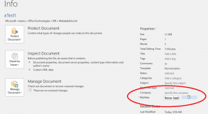
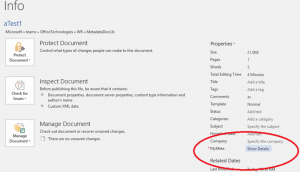

# Linked SharePoint metadata columns can't be edited in version 16.0.7167.2040+ of Office client applications

[Warren\_R\_Msft](https://social.msdn.microsoft.com/profile/Warren_R_Msft)
9/30/2016 9:02:37 PM

-----

**Update:**

\*\*This issue is now resolved, in build
16.0.7369.2054.

**Issue:**

Managed metadata SharePoint document properties can not be edited in the
rich client Office applications starting in build 16.0.7167.2040, this
is a defect and not by design.

Screen shot of working (prior to
7167)

Not working
(7167+)

**Workarounds:**

Roll back the Office 2016 client to a version prior to 7167 or edit the
properties with the SharePoint UI.

**Current Status:**

The product group is actively working on this issue right now, check
back to this blog post for updates.

