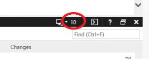

# SharePoint 2013 / SharePoint 2016 / IE11 files do not open correctly in Office Client Apps, IE Doc mode 10 required

[Warren\_R\_Msft](https://social.msdn.microsoft.com/profile/Warren_R_Msft)
5/2/2017 2:16:25 PM

-----

**Overview:**

From the SharePoint 2013/2016 document library UI, Office documents open
in the web application instead of the rich client application (when it
should not) or there are other issues opening documents from the
SharePoint UI to the Office rich client application.  An indicator of
this issue would be when an out of the box un-customized document
library works fine, but a customized document library does not work.

**Issue:**

The SharePoint JavaScript code requires IE document mode 10 for the
pages to work correctly in IE 11.  You can see what doc mode the browser
is in by opening the F12 Developer tools in IE and looking at the value
in the upper right hand corner, see picture
below:

**Workaround:**

If IE is being put into document mode 11 or Edge you will need to change
your custom code (master pages, etc) to not modify the IE document mode
or to specify document mode 10.

For example:

\<meta http-equiv="X-UA-Compatible" content="IE=10" /\>

